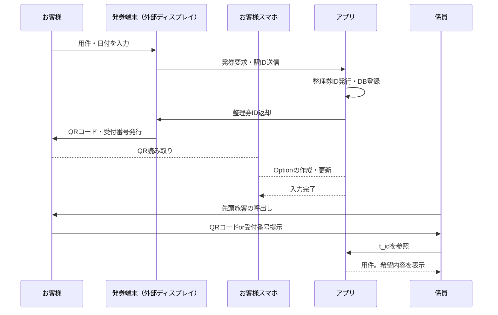
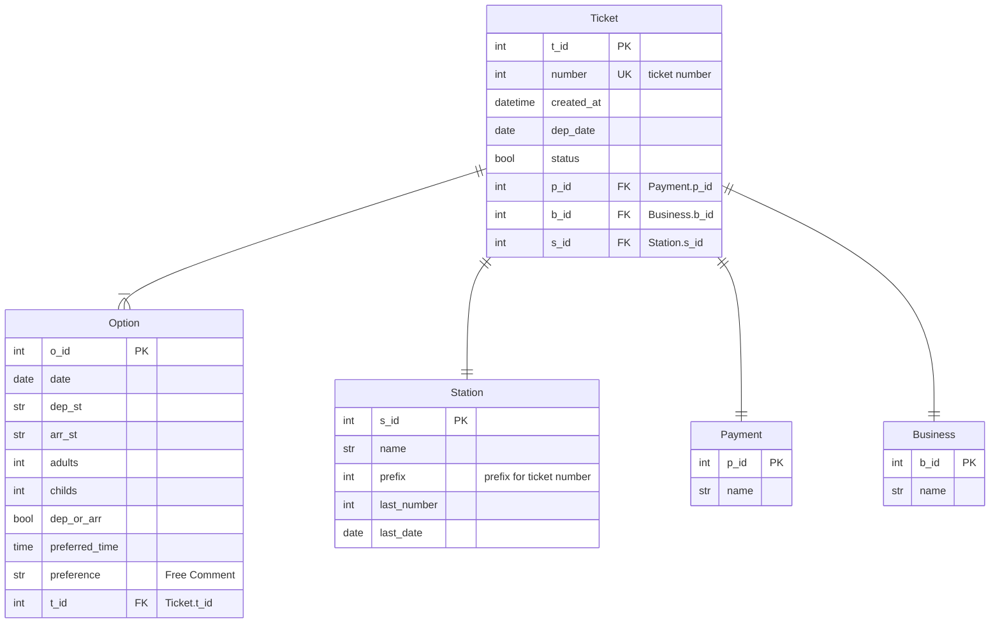
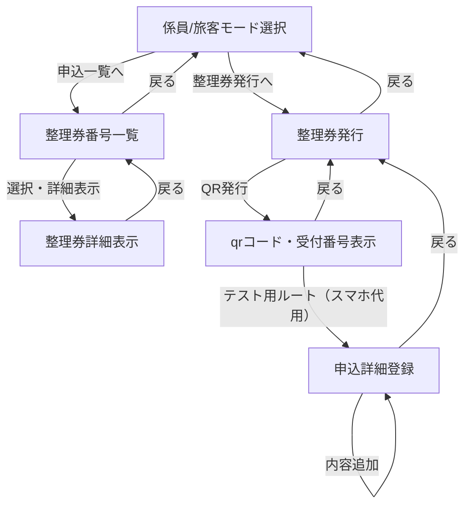

# 利用フロー

```mermaid
sequenceDiagram
    participant Customer as お客様
    participant Display as 発券端末（外部ディスプレイ）
    participant Smartphone as お客様スマホ
    participant App as アプリ
    participant Staff as 係員

    Customer ->> Display: 用件・日付を入力
    Display ->> App: 発券要求・駅ID送信
    App ->> App : 整理券ID発行・DB登録
    App ->> Display: 整理券ID返却
    Display ->> Customer: QRコード・受付番号発行

    Customer --> Smartphone: QR読み取り
    Smartphone --> App: Optionの作成・更新
    App -->> Smartphone: 入力完了

    Staff ->> Customer : 先頭旅客の呼出し
    Customer ->> Staff : QRコードor受付番号提示
    Staff ->> App: t_idを参照
    App -->> Staff: 用件。希望内容を表示
```
# ER図

```mermaid
erDiagram

Ticket ||--|{ Option : ""
Ticket ||--|| Station : ""
Ticket ||--|| Payment : ""
Ticket ||--|| Business : ""

Ticket {
    int t_id PK
    int number UK "ticket number"
    datetime created_at
    date dep_date
    bool status 
    int p_id FK "Payment.p_id"
    int b_id FK "Business.b_id"
    int s_id FK "Station.s_id"
}

Option {
    int o_id PK
    date date
    str dep_st
    str arr_st
    int adults
    int childs
    bool dep_or_arr
    time preferred_time
    str preference "Free Comment"
    int t_id FK "Ticket.t_id"
}

Station {
    int s_id PK
    str name
    int prefix "prefix for ticket number"
    int last_number
    date last_date
}

Payment {
    int p_id PK
    str name
}

Business {
    int b_id PK
    str name
}
```

# 画面遷移図

```mermaid
flowchart TD

%% ============================
%% 画面ノード（ここを書き換える）
%% ============================
index[係員/旅客モード選択]
list[整理券番号一覧]
detail[整理券詳細表示]
ticket[整理券発行]
qr[qrコード・受付番号表示]
option[申込詳細登録]


%% ============================
%% 遷移（ここに矢印を追加していく）
%% ============================

%% from index
index -->|申込一覧へ| list
index -->|整理券発行へ| ticket


%% from ticket
ticket -->|QR発行| qr
ticket -->|戻る| index

%% from qr
qr -->|戻る| ticket
qr -->|テスト用ルート（スマホ代用）| option


%% from option
option -->|内容追加| option
option -->|戻る| ticket

%% from list
list -->|戻る| index
list -->|選択・詳細表示| detail

%% from detail
detail -->|戻る| list
```
